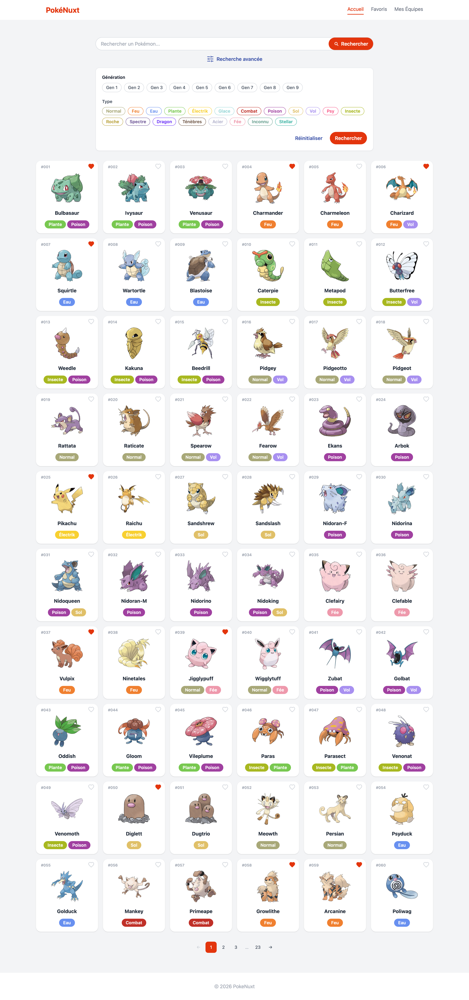
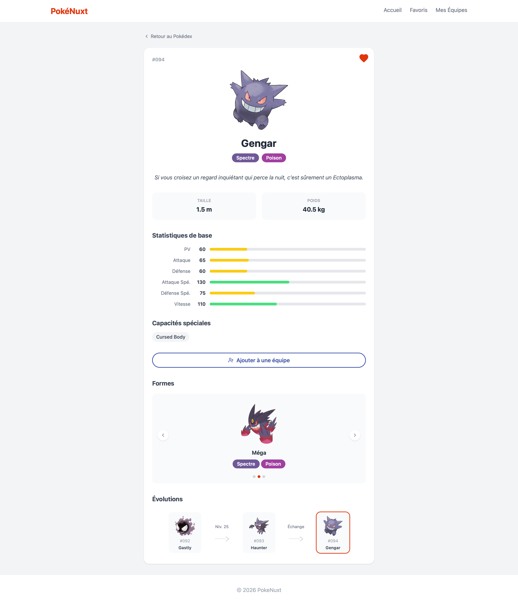
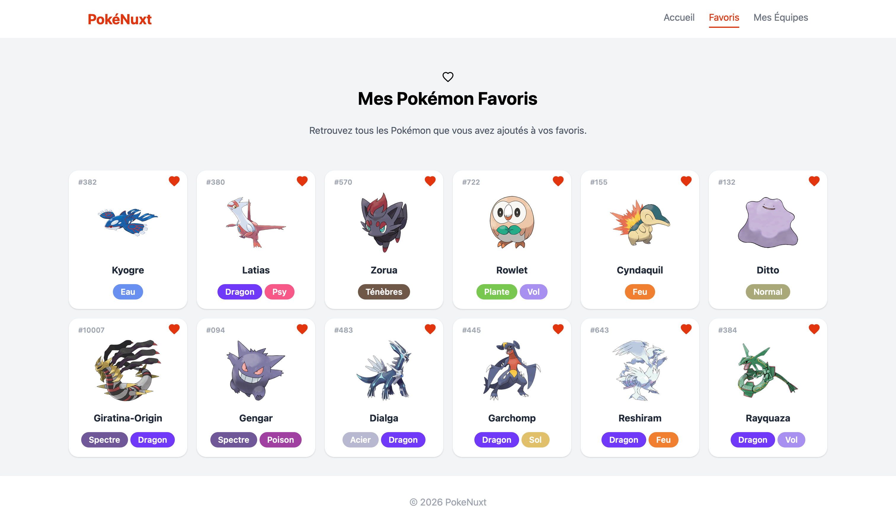
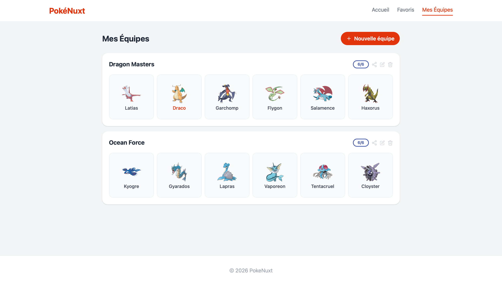
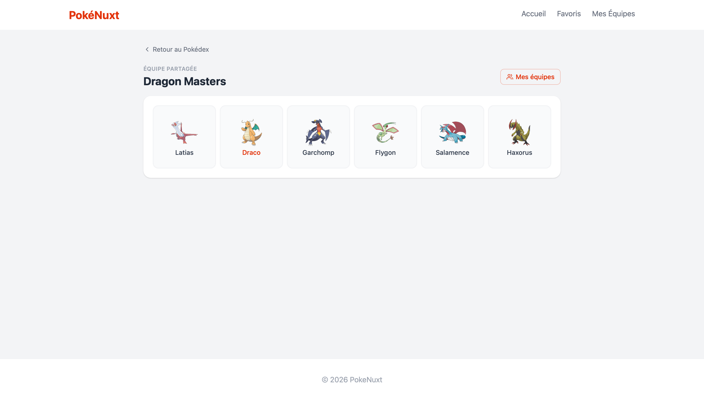

# PokéNuxt

Application web Pokémon développée avec Nuxt 4, permettant de consulter l'ensemble du Pokédex, d'explorer les fiches détaillées de chaque Pokémon, de gérer ses favoris et de construire des équipes personnalisées partageables.

Les données proviennent de [PokéAPI v2](https://pokeapi.co/), une API publique et gratuite.

## Fonctionnalités

### Pokédex
Parcourez l'intégralité des Pokémon avec pagination.  
La recherche avancée permet de filtrer par **génération** et par **type**. Chaque carte est cliquable et mène à la fiche détaillée.



---

### Fiche Pokémon
La page détail d'un Pokémon regroupe toutes ses informations :
- Numéro, types, description
- Taille et poids
- Statistiques de base
- Capacités
- Formes alternatives
- Chaîne d'évolutions complète avec les conditions
- Ajout aux favoris
- Ajout à une ou plusieurs équipes



---

### Favoris
Retrouvez en un coup d'œil tous les Pokémon marqués comme favoris. Les favoris sont sauvegardés localement (localStorage) et persistent après un rechargement de page.



---

### Équipes
Créez et gérez plusieurs équipes de 6 Pokémon maximum :
- Nommer et renommer une équipe
- Ajouter un Pokémon depuis la fiche détaillée ou directement depuis la page équipes
- Donner un surnom à chaque Pokémon
- Réorganiser les Pokémon par **glisser-déposer**
- Retirer un Pokémon de l'équipe
- Supprimer une équipe
- Les équipes sont sauvegardées localement et persistent après un rechargement



---

### Partage d'équipe
Partagez une équipe via un lien URL unique. Le destinataire accède à une vue en lecture seule de l'équipe. Le lien encode les données de l'équipe directement dans l'URL.



## Routes

| URL | Description |
|-----|-------------|
| `/` | Pokédex — liste et recherche de Pokémon |
| `/pokemon/:id` | Fiche détaillée d'un Pokémon |
| `/favorites` | Liste des Pokémon favoris |
| `/teams` | Gestion des équipes |
| `/share?t=...` | Vue partagée d'une équipe |

---

## Prérequis

- [Node.js](https://nodejs.org/) v18 ou supérieur
- [npm](https://www.npmjs.com/) v9 ou supérieur

## Installation

```bash
npm install
```

## Développement

Lance le serveur de développement sur `http://localhost:3000` :

```bash
npm run dev
```

## Production

Compile l'application pour la production :

```bash
npm run build
```

Prévisualise le build de production localement :

```bash
npm run preview
```

---

## Limites

- **Dépendance à PokéAPI** — L'application repose entièrement sur [PokéAPI](https://pokeapi.co/), une API tierce non maintenue par le projet. Si l'API est indisponible, l'application ne peut afficher aucun Pokémon.
- **Données en lecture seule** — PokéAPI ne permet pas de modifier, d'ajouter ou de supprimer les informations des Pokémon.
- **Persistance locale uniquement** — Les favoris et les équipes sont stockés dans le `localStorage` du navigateur. Les données sont perdues si l'utilisateur vide son cache, change de navigateur ou d'appareil.
- **Pas d'authentification** — Il n'y a pas de notion de compte utilisateur. Deux personnes sur le même appareil partagent les mêmes favoris et équipes.

## Améliorations possibles

- **Base de données** — Remplacer le `localStorage` par une base de données couplée à un système d'authentification, afin de rendre les favoris et les équipes persistants entre appareils et navigateurs.
- **Informations supplémentaires** — Enrichir les fiches Pokémon avec les attaques apprises, les lieux de capture, les compatibilités de reproduction ou les données compétitives (EV/IV).

## Auteurs

- [Florent MENUS](https://github.com/FloMenus)
- [Tom DEPUSSAY](https://github.com/tomdepussay)
